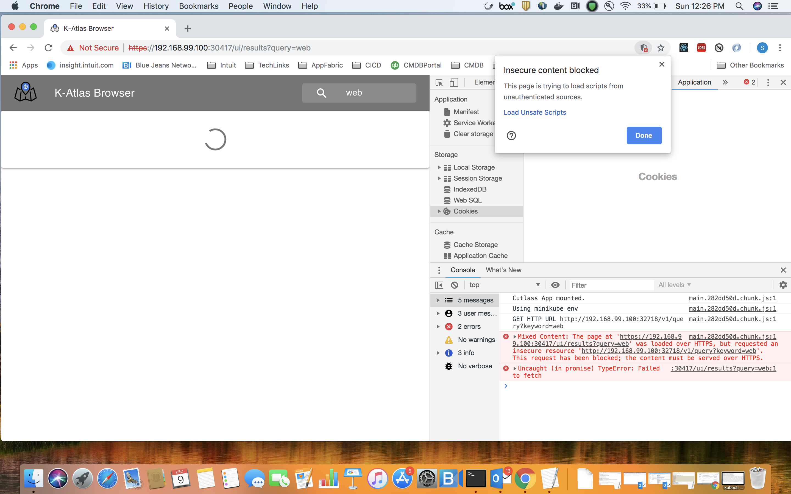

# FAQ

### How do I get the Port to connect to Dgraph on the minikube cluster to setup the Schema and Metadata?

  
Assuming you have minikube installed and Dgraph is up, run the below command and check the public service for the dgraph Server. Here port 31265 will correspond to the NodePort for the service.

$ kubectl get services

NAME                  TYPE           CLUSTER-IP       EXTERNAL-IP   PORT\(S\)                         AGE

dgraph-alpha-public   LoadBalancer   10.101.113.42    &lt;pending&gt;     8080:30620/TCP,9080:31265/TCP   1d

### 

### Cutlass UI blocked by CORS Policy when a Request is made ?

Ensure CORS plugin is installed and enabled in the Chrome. 

### Cutlass UI gives Mixed Content error and fails to load data when Request is made?

When the Mixed Content Error is seen , click on the Shield Icon on the right corner of the browser bar and select "Load Unsafe Scripts" in the dialog that appears as below.

### How do I access the Dgraph Ratel Browser and check the Schema and Data loaded in it?

Refer to the below mentioned Dgraph services.

$ kubectl get services

dgraph-ratel-public   LoadBalancer   10.109.199.98    &lt;pending&gt;     8000:32116/TCP                  1d

dgraph-alpha-public   LoadBalancer   10.101.113.42    &lt;pending&gt;     8080:30620/TCP,9080:31265/TCP   1d

Please connect to the dgraph-ratel-public Service on the NodePort. 

In this case, http://&lt;minikube-ip&gt;:32116

Once connected to the Ratel Server, Setup the Dgraph Server to Connect to using the dgraph-alpha-pulic Service. 

In this case, http://&lt;minikube-ip&gt;:30620

Then view the Schema, or run Queries.

